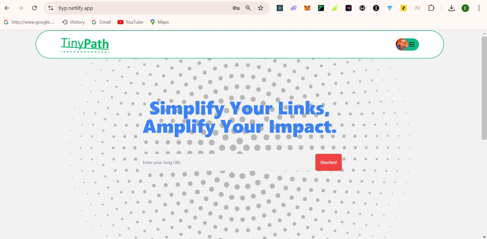
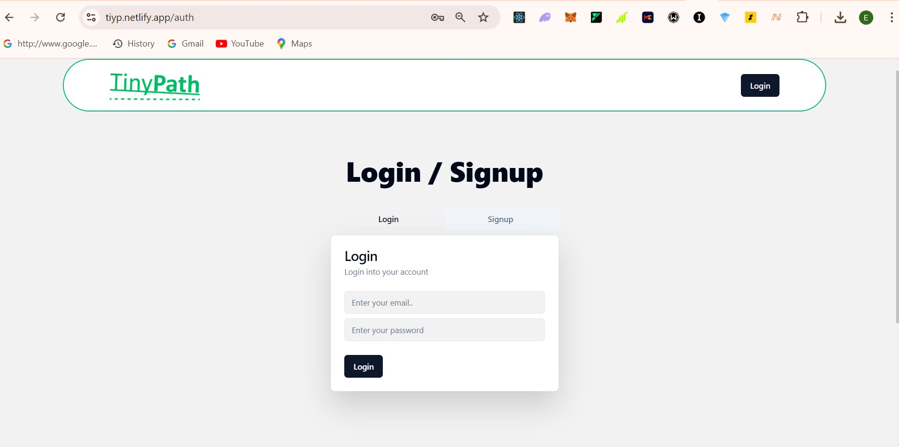
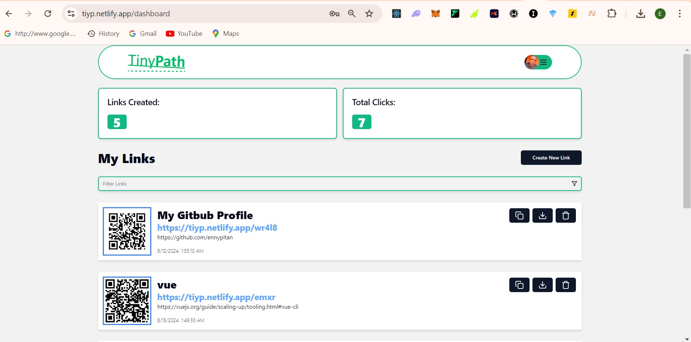
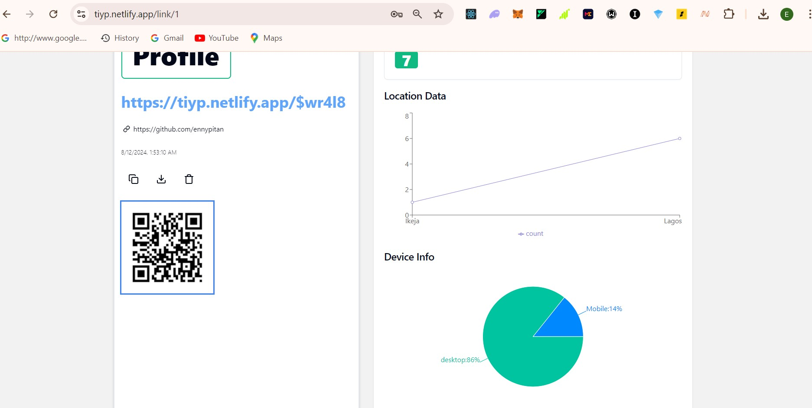
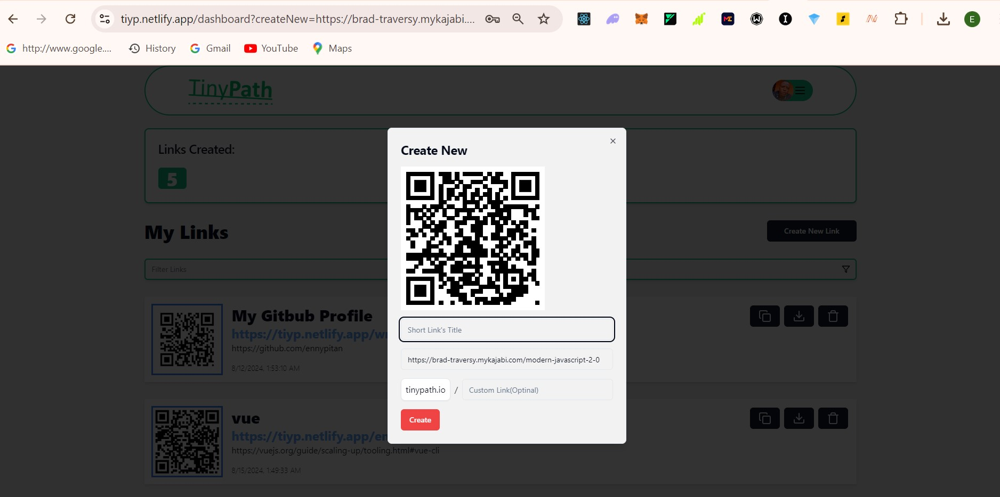

# Tinypath



[Live Project Link](https://tiyp.netlify.app//)

**Tinypath** is a powerful and user-friendly URL shortener platform designed to make sharing links easier and more efficient. Whether you need to shorten long URLs, create custom branded links, generate QR codes, or track the performance of your URLs, Tinypath has got you covered.

##### Features

1. **URL Shortening**
   Tinypath allows users to shorten URLs effortlessly. Simply paste a long URL into the platform, and a shorter, more manageable URL is automatically generated. This shortened URL is optimized for speed and ease of sharing across social media, email, and other channels.

2. **Custom URLs**
   With Tinypath, users can customize their shortened URLs to reflect their brand or content. This feature is especially useful for individuals, small businesses, and marketers who want to create branded links that enhance their online presence. Choose a custom domain and personalize your URL to make it more memorable and aligned with your brand.

3. **QR Code Generation**
   Tinypath provides an integrated QR code generation feature, allowing users to create QR codes for their shortened URLs. These QR codes can be downloaded and incorporated into promotional materials, websites, or business cards, making it easy to direct users to your links with a simple scan.

4. **Analytics**
   Track the performance of your shortened URLs with Tinypath’s built-in analytics. Users can monitor how many clicks their links receive, as well as the geographic location and devices of their audience. This data is invaluable for understanding your audience and optimizing your link-sharing strategy.

#### Technologies Used

**React:** A JavaScript library developed by Facebook for building user interfaces. React enables the creation of reusable UI components, making it easier to manage the state and structure of complex web applications.

**Shadcn UI:** A collection of modern, accessible UI components for React. It provides a set of pre-styled components that can be customized and used to build aesthetically pleasing and user-friendly interfaces.

**Supabase:** An open-source backend-as-a-service platform that provides a real-time database, authentication, and storage. Supabase aims to simplify backend development by offering easy integration with PostgreSQL databases.

**React Router DOM:** A library for routing in React applications. It enables navigation between different components or pages in a single-page application (SPA) without refreshing the page, providing a seamless user experience.

**Lucide React:** A collection of open-source icons for React. Lucide React provides a set of customizable, high-quality icons that can be easily integrated into React applications for improved visual appeal and functionality.

**React Spinner:** A library for adding loading spinners to React applications. React Spinner provides various spinner components to indicate ongoing background processes or data loading, enhancing the user experience during delays.

**Yup:** A JavaScript schema builder for value parsing and validation. Yup is commonly used with form libraries to validate user inputs based on defined schemas, ensuring data integrity and correctness.

**React QRCode Logo:** A React component for generating QR codes. It provides an easy way to create and display QR codes, which can be useful for linking to URLs or sharing information in a scannable format.

**UA Parser:** A JavaScript library for parsing user agent strings. UA Parser helps in identifying browser, operating system, and device information from the user agent, which can be used for analytics or adaptive user experiences.

**Recharts:** A composable charting library built on React components. Recharts provides a set of declarative chart components that are highly customizable, making it easy to create interactive and responsive data visualizations.

##### Installation

To get started with Tinypath, follow these steps:

```# Clone the repository
git clone https://github.com/ennypitan/tinypath.git

# Navigate to the project directory
cd tinypath

# Install dependencies
npm install

# Start the development server
npm start
```

## Usage

- **Shorten a URL:** Paste a long URL into the input field on the homepage and click "Shorten."
- **Customize a URL:** After shortening a URL, click "Customize" to personalize your link.
- **Generate a QR Code:** The application automatically generates a QR Code for the shorten link

* **View Analytics:** Navigate to the "Analytics" tab to view detailed statistics for your links.

#### Contributing

Contributions are welcome! If you have ideas to improve Tinypath or find any issues, feel free to fork the repository and submit a pull request.

##### License

This project is licensed under the MIT License - see the LICENSE file for details

This project was developed by **Ennypitan Adekoya** as part of the Capstone Project at **AltSchool Africa School of Engineering**.

##### Screenshots





